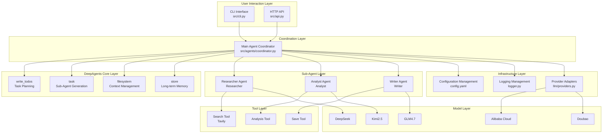
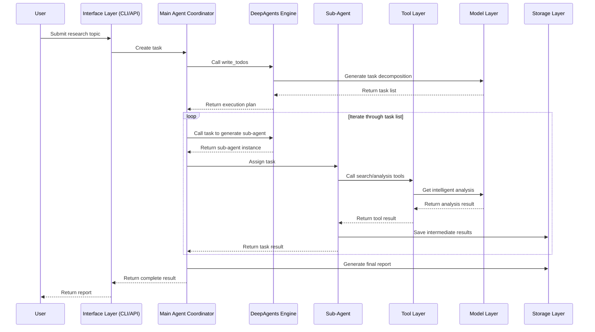
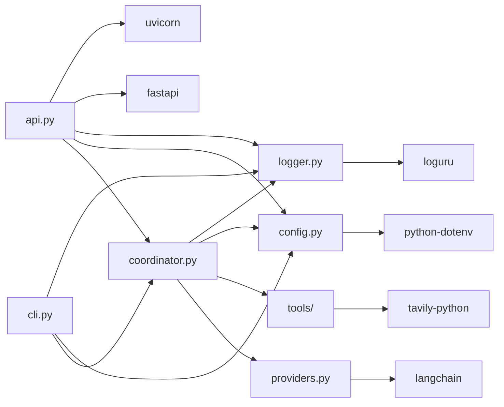

# X-DeepAgents

<div align="center">

**A Production-Grade DeepAgents Learning and Practice Project**

Intelligent Market Research Report Generation System based on LangChain DeepAgents Framework

[](https://www.python.org/)
[](https://github.com/langchain-ai/langchain)
[](https://fastapi.tiangolo.com/)
[](https://opensource.org/licenses/MIT)

</div>

---

## Project Introduction

X-DeepAgents is a complete DeepAgents learning and practice project focused on demonstrating how to build intelligent agent systems capable of handling complex, multi-step tasks using the DeepAgents framework. Using "automated market research report generation" as a real business scenario, the project implements an end-to-end intelligent workflow from task input to report output.

### Core Value

- **Deep Learning**: Understand the four core capabilities of DeepAgents (intelligent planning, context management, sub-agent generation, long-term memory) through a real project
- **Production Ready**: Complete code implementation, configuration management, logging system, and service deployment solutions
- **Easy to Extend**: Clear modular design supporting rapid addition of new sub-agents, tools, and integration points

### Use Cases

- Developers learning DeepAgents framework and agent architecture
- Enterprises quickly building intelligent analysis systems based on multi-agent collaboration
- Researchers exploring implementation solutions for complex task decomposition and execution

---

## Core Features

- **Multi-Agent Collaboration Architecture**: Three professional agents (Researcher, Analyst, Writer) collaborate to complete complex research tasks
- **Intelligent Task Decomposition**: Automatic execution path planning based on DeepAgents `write_todos` tool
- **Dual Mode Access**: Supports both CLI command line and HTTP API interaction modes
- **Asynchronous Task Processing**: Supports asynchronous task execution and SSE streaming progress feedback
- **Automatic Report Archiving**: Research results automatically saved to local file system
- **Multi-Model Support**: Integrates multiple LLMs including DeepSeek, Kimi2.5, GLM4.7, Alibaba Cloud Qwen, and Doubao
- **Production-Grade Logging**: Structured logging based on Loguru with log rotation and persistence
- **Containerized Deployment**: Provides standard Dockerfile and docker-compose.yml configurations
- **Hot Reload Development**: Local development mode supports code hot reload and debugging
- **Complete Test Coverage**: Includes unit tests and integration test examples

---

## Project Structure

```
x-deepagents/
├── src/                              # Source code directory
│   ├── agents/                       # Agent modules
│   │   ├── coordinator.py            # Main agent coordinator (multi-agent orchestration core)
│   │   └── __init__.py
│   ├── core/                         # Core infrastructure
│   │   ├── config.py                 # Configuration management (.env + config.yaml)
│   │   ├── logger.py                 # Logging management (based on Loguru)
│   │   └── __init__.py
│   ├── llm/                          # LLM provider adapters
│   │   ├── providers.py              # Multi-LLM provider unified interface
│   │   └── __init__.py
│   ├── tools/                        # Tool modules
│   │   ├── __init__.py               # Search, analysis, report save tools
│   │   └── ...
│   ├── api.py                        # FastAPI service entry (sync + async + SSE)
│   ├── cli.py                        # Command line entry (interactive / single query)
│   └── __init__.py
├── examples/                         # Example code
│   ├── multi_agent.py                # Multi-agent collaboration example
│   ├── multi_agent_example.py        # Complete execution example
│   ├── simple_example.py             # Simple mode example
│   └── mcp_tool_config.py            # MCP tool configuration example
├── reports/                          # Report output directory
├── logs/                             # Log directory
├── tests/                            # Test directory
├── config.yaml                       # Application configuration file
├── .env.example                      # Environment variable template
├── Dockerfile                        # Docker image build file
├── docker-compose.yml                # Docker Compose orchestration file
├── .dockerignore                     # Docker ignore file
├── pyproject.toml                    # Project dependencies and scripts configuration
├── .gitignore                        # Git ignore file
├── LICENSE                           # MIT License
├── README.md                         # Chinese documentation
└── README.en.md                      # English documentation
```

---

## System Architecture

### System Layered Architecture Diagram



### Core Function Business Flow Diagram



### Module Dependency Diagram



---

## Quick Start

### Environment Requirements

#### Windows
- Windows 10/11
- Python 3.11 or higher
- [uv](https://github.com/astral-sh/uv) package manager
- Docker Desktop (optional, for containerized deployment)

#### Linux / macOS
- Python 3.11 or higher
- [uv](https://github.com/astral-sh/uv) package manager
- Docker (optional, for containerized deployment)

### Project Cloning

```bash
# Clone project using Git
git clone https://github.com/chain-engine/x-deepagents.git
cd x-deepagents
```

### Dependency Installation

```bash
# Install dependencies using uv
uv sync
```

### Configuration File Creation

#### 1. Environment Variable Configuration (.env)

```bash
# Linux / macOS
cp .env.example .env

# Windows PowerShell
copy .env.example .env
```

Edit the `.env` file and configure at least one LLM provider's API key:

| Configuration | Description | Required |
|---------------|-------------|----------|
| `LLM_PROVIDER` | Selected LLM provider (deepseek/kimi2.5/glm4.7/aliyun/doubao) | Yes |
| `DEEPSEEK_API_KEY` | DeepSeek API key | Depends on LLM_PROVIDER |
| `KIMI_API_KEY` | Kimi2.5 API key | Depends on LLM_PROVIDER |
| `GLM_API_KEY` | GLM4.7 API key | Depends on LLM_PROVIDER |
| `ALIYUN_API_KEY` | Alibaba Cloud API key | Depends on LLM_PROVIDER |
| `DOUBAO_API_KEY` | Doubao API key | Depends on LLM_PROVIDER |
| `TAVILY_API_KEY` | Tavily search API key | Yes (required for search) |
| `TEMPERATURE` | Model temperature parameter (0.0-1.0) | No, default 0.1 |
| `DEBUG` | Debug mode switch | No, default False |

#### 2. Application Configuration (config.yaml)

`config.yaml` contains the following configuration items:

```yaml
server:
  debug: true              # Debug mode
  port: 8000               # Service port

logging:
  level: INFO              # Log level
  file_path: logs/market_research.log  # Log file path
  rotation: "1 day"        # Log rotation period
  retention: "7 days"      # Log retention time

agent:
  main_agent:
    max_iterations: 50     # Maximum iterations
    timeout: 300           # Timeout (seconds)
    verbose: true          # Verbose output

research:
  output_dir: "reports"    # Report output directory
  max_sources: 20          # Maximum number of sources
```

### Service Startup

#### 1. Local Development Mode Startup

**Supports hot reload and debug mode**

```bash
# Start FastAPI service (development mode with hot reload)
uv run uvicorn src.api:app --reload --host 0.0.0.0 --port 8000

# Or start directly with uvicorn (production mode)
uv run uvicorn src.api:app --host 0.0.0.0 --port 8000
```

**CLI Mode Execution**

```bash
# Interactive mode
uv run market-research

# Single query
uv run market-research "China New Energy Vehicle Market Analysis Report"

# Simple mode (single agent)
uv run market-research -s "AI Industry Investment Opportunities"
```

#### 2. Docker Containerized Deployment

```bash
# Build and start service
docker compose up --build -d

# Check service status
docker compose ps

# View logs
docker compose logs -f

# Stop service
docker compose down

# Stop and remove data volumes
docker compose down -v
```

**Running CLI in Docker**

```bash
# Execute single query
docker compose run --rm x-deepagents python /app/src/cli.py "China New Energy Vehicle Market Analysis Report"

# Execute simple mode
docker compose run --rm x-deepagents python /app/src/cli.py -s "AI Industry Investment Opportunities"
```

### Common Commands

```bash
# Run tests
uv run pytest

# Run tests with coverage report
uv run pytest --cov=src --cov-report=html

# Code formatting
uv run ruff format .

# Code linting
uv run ruff check .

# Type checking
uv run mypy src/

# Start interactive Python
uv run python
```

---

## Technology Stack

### Web Framework
- **FastAPI** (0.110+) - Modern, high-performance web framework
- **Uvicorn** (0.27+) - ASGI server

### Core Framework
- **DeepAgents** (0.2.0+) - Agent framework
- **LangChain** (0.3.0+) - Large language model application development framework
- **LangGraph** (0.2.0+) - Stateful multi-agent runtime

### Data Validation
- **Pydantic** (2.0.0+) - Data validation and settings management
- **Pydantic Settings** (2.0.0+) - Environment variable management

### Tool Libraries
- **Tavily Python** (0.5.0+) - Intelligent search API
- **Loguru** (0.7.0+) - Logging management
- **PyYAML** (6.0.0+) - YAML configuration parsing
- **Rich** (13.0.0+) - Terminal beautification output
- **python-dotenv** (1.0.0+) - Environment variable loading
- **httpx** (0.27.0+) - Asynchronous HTTP client
- **aiofiles** (24.0.0+) - Asynchronous file operations

### Development Tools
- **uv** - Fast Python package manager
- **pytest** (8.0.0+) - Testing framework
- **pytest-asyncio** (0.24.0+) - Async test support
- **pytest-cov** (5.0.0+) - Test coverage
- **ruff** (0.6.0+) - Fast Python linter and formatter
- **mypy** (1.11.0+) - Static type checker

### Deployment Tools
- **Docker** - Containerized deployment
- **Docker Compose** - Multi-container orchestration

---

## API Documentation

After starting the service, you can access the API documentation at the following addresses:

- **Swagger UI (Interactive Documentation)**: http://localhost:8000/docs
- **ReDoc (Read-only Documentation)**: http://localhost:8000/redoc
- **OpenAPI JSON**: http://localhost:8000/openapi.json

### Main API Endpoints

| Method | Path | Description |
|--------|------|-------------|
| `GET` | `/health` | Health check |
| `POST` | `/research` | Synchronous research execution, returns final result |
| `POST` | `/research/start` | Asynchronously create task, returns `job_id` |
| `GET` | `/jobs/{job_id}` | Query task status and result |
| `GET` | `/jobs/{job_id}/stream` | SSE streaming task progress |

---

## Storage Configuration

### Local Storage

**Report Storage**

- Default directory: `reports/`
- Configuration: `research.output_dir` in `config.yaml`
- File format: Markdown (.md)

**Log Storage**

- Default directory: `logs/`
- Configuration: `logging.file_path` in `config.yaml`
- Rotation policy: `logging.rotation` (default 1 day)
- Retention policy: `logging.retention` (default 7 days)

### Object Storage

The current version only supports local file system storage. To integrate with object storage (such as S3, OSS, COS), you can extend the `src/tools/` module to add corresponding storage tools.

---

## License

This project is licensed under the MIT License. See the [LICENSE](LICENSE) file for details.

---

## References

- [DeepAgents Official Documentation](https://python.langchain.com/docs/deepagents/)
- [LangChain Official Documentation](https://python.langchain.com/)
- [LangGraph Official Documentation](https://langchain-ai.github.io/langgraph/)
- [FastAPI Official Documentation](https://fastapi.tiangolo.com/)
- [Python Official Documentation](https://docs.python.org/3.11/)
- [uv Official Documentation](https://github.com/astral-sh/uv)
- [Pydantic Official Documentation](https://docs.pydantic.dev/)
- [Docker Official Documentation](https://docs.docker.com/)

---

## Contact

- **Author**: John Young (Ye Yu Shi Lai)
- **Email**: john.young@foxmail.com
- **Gitee**: https://gitee.com/yeyushilai
- **GitHub**: https://github.com/yeyushilai

---

<div align="center">

**If this project helps you, please give it a Star ⭐**

</div>
