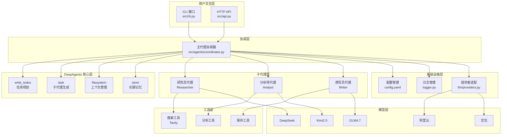
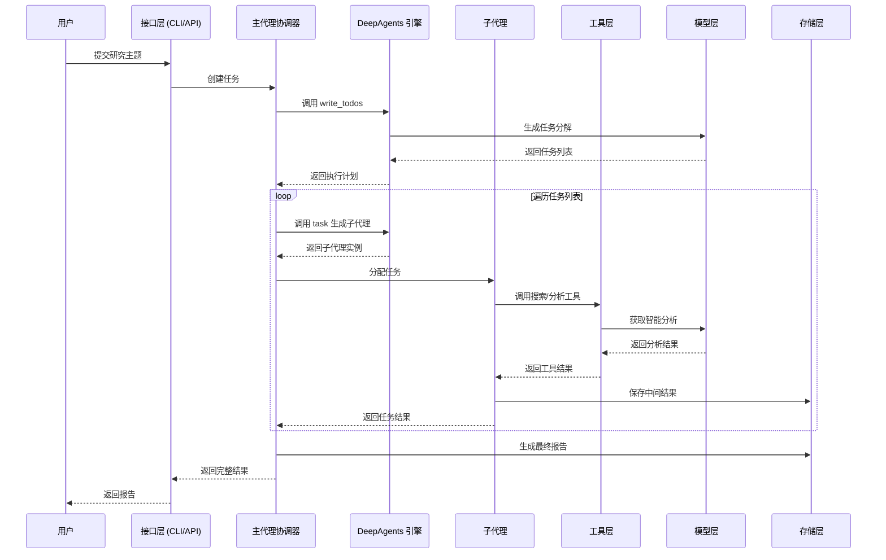
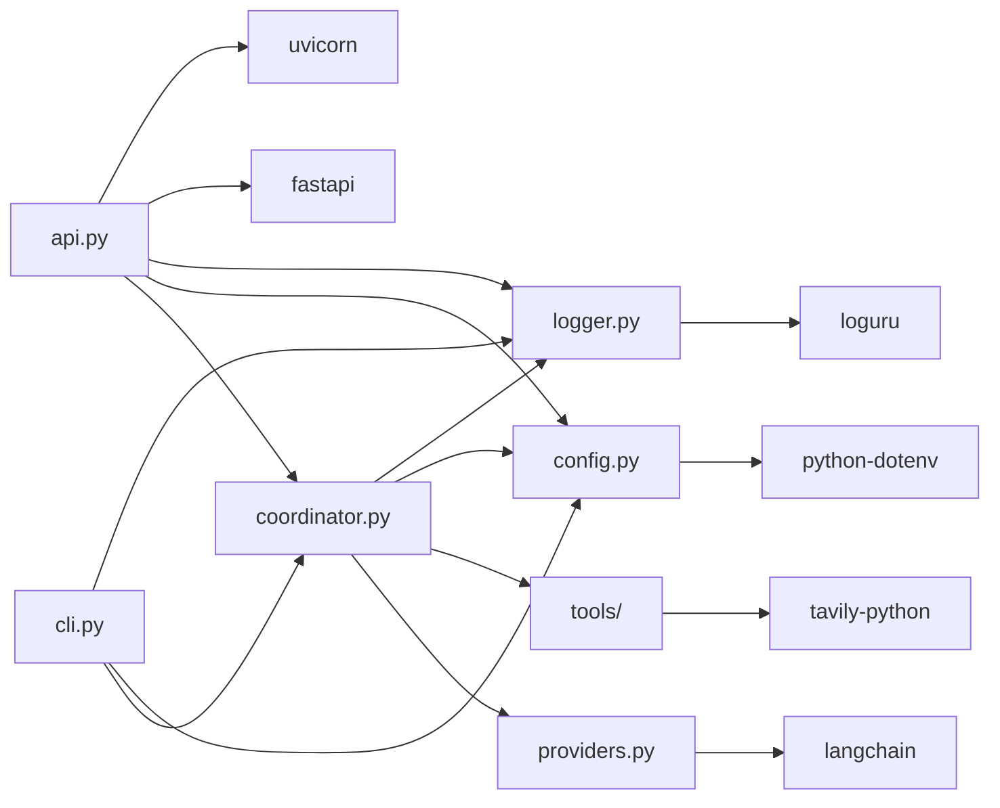

# X-DeepAgents

<div align="center">

**一个生产级的 DeepAgents 学习与实践项目**

[](https://www.python.org/)
[](https://github.com/langchain-ai/langchain)
[](https://fastapi.tiangolo.com/)
[](https://opensource.org/licenses/MIT)

</div>

---

## 项目简介

X-DeepAgents 是一个完整的 DeepAgents 学习与实践项目，专注于展示如何使用 DeepAgents 框架构建能够处理复杂、多步骤任务的智能体系统。项目以"市场研究报告自动生成"为真实业务场景，完整实现了一个从任务输入到报告输出的端到端智能工作流。

### 核心价值

- **深度学习**：通过真实项目理解 DeepAgents 的四大核心能力（智能规划、上下文管理、子代理生成、长期记忆）
- **生产就绪**：提供完整的代码实现、配置管理、日志系统和服务化部署方案
- **易于扩展**：清晰的模块化设计，支持快速添加新的子代理、工具和集成点

### 适用场景

- 开发者学习 DeepAgents 框架和智能体架构
- 企业快速搭建基于多代理协作的智能分析系统
- 研究人员探索复杂任务分解与执行的实现方案

---

## 核心特征

- **多代理协作架构**：研究员、分析师、撰写员三个专业代理协同完成复杂研究任务
- **智能任务分解**：基于 DeepAgents `write_todos` 工具自动规划执行路径
- **双模式接入**：同时支持 CLI 命令行和 HTTP API 两种交互方式
- **异步任务处理**：支持任务异步执行和 SSE 流式进度反馈
- **报告自动归档**：研究结果自动保存至本地文件系统
- **多模型支持**：集成 DeepSeek、Kimi2.5、GLM4.7、阿里云通义千问、豆包等多种 LLM
- **生产级日志**：基于 Loguru 的结构化日志，支持日志轮转和持久化
- **容器化部署**：提供标准的 Dockerfile 和 docker-compose.yml 配置
- **热重载开发**：本地开发模式支持代码热重载和调试
- **完整测试覆盖**：包含单元测试和集成测试示例

---

## 项目结构

```
x-deepagents/
├── src/                              # 源代码目录
│   ├── agents/                       # 代理模块
│   │   ├── coordinator.py            # 主代理协调器（多代理编排核心）
│   │   └── __init__.py
│   ├── core/                         # 核心基础设施
│   │   ├── config.py                 # 配置管理（.env + config.yaml）
│   │   ├── logger.py                 # 日志管理（基于 Loguru）
│   │   └── __init__.py
│   ├── llm/                          # LLM 提供者适配
│   │   ├── providers.py              # 多 LLM 提供者统一接口
│   │   └── __init__.py
│   ├── tools/                        # 工具模块
│   │   ├── __init__.py               # 搜索、分析、报告保存工具
│   │   └── ...
│   ├── api.py                        # FastAPI 服务入口（同步+异步+SSE）
│   ├── cli.py                        # 命令行入口（交互式/单次查询）
│   └── __init__.py
├── examples/                         # 示例代码
│   ├── multi_agent.py                # 多代理协作示例
│   ├── multi_agent_example.py        # 完整执行示例
│   ├── simple_example.py             # 简单模式示例
│   └── mcp_tool_config.py            # MCP 工具配置示例
├── reports/                          # 报告输出目录
├── logs/                             # 日志目录
├── tests/                            # 测试目录
├── config.yaml                       # 应用配置文件
├── .env.example                      # 环境变量模板
├── Dockerfile                        # Docker 镜像构建文件
├── docker-compose.yml                # Docker Compose 编排文件
├── .dockerignore                     # Docker 忽略文件
├── pyproject.toml                    # 项目依赖与脚本配置
├── .gitignore                        # Git 忽略文件
├── LICENSE                           # MIT 许可证
├── README.md                         # 中文文档
└── README.en.md                      # 英文文档
```

---

## 系统架构

### 系统分层架构图



### 核心功能业务流程图



### 模块依赖关系图



---

## 快速开始

### 环境要求

#### Windows
- Windows 10/11
- Python 3.11 或更高版本
- [uv](https://github.com/astral-sh/uv) 包管理器
- Docker Desktop（可选，用于容器化部署）

#### Linux / macOS
- Python 3.11 或更高版本
- [uv](https://github.com/astral-sh/uv) 包管理器
- Docker（可选，用于容器化部署）

### 项目克隆

```bash
# 使用 Git 克隆项目
git clone https://github.com/chain-engine/x-deepagents.git
cd x-deepagents
```

### 依赖安装

```bash
# 使用 uv 安装依赖
uv sync
```

### 配置文件创建

#### 1. 环境变量配置（.env）

```bash
# Linux / macOS
cp .env.example .env

# Windows PowerShell
copy .env.example .env
```

编辑 `.env` 文件，至少配置一个 LLM 提供者的 API 密钥：

| 配置项 | 说明 | 必填 |
|--------|------|------|
| `LLM_PROVIDER` | 选择的 LLM 提供者（deepseek/kimi2.5/glm4.7/aliyun/doubao） | 是 |
| `DEEPSEEK_API_KEY` | DeepSeek API 密钥 | 取决于 LLM_PROVIDER |
| `KIMI_API_KEY` | Kimi2.5 API 密钥 | 取决于 LLM_PROVIDER |
| `GLM_API_KEY` | GLM4.7 API 密钥 | 取决于 LLM_PROVIDER |
| `ALIYUN_API_KEY` | 阿里云 API 密钥 | 取决于 LLM_PROVIDER |
| `DOUBAO_API_KEY` | 豆包 API 密钥 | 取决于 LLM_PROVIDER |
| `TAVILY_API_KEY` | Tavily 搜索 API 密钥 | 是（搜索功能需要） |
| `TEMPERATURE` | 模型温度参数（0.0-1.0） | 否，默认 0.1 |
| `DEBUG` | 调试模式开关 | 否，默认 False |

#### 2. 应用配置（config.yaml）

`config.yaml` 包含以下配置项：

```yaml
server:
  debug: true              # 调试模式
  port: 8000               # 服务端口

logging:
  level: INFO              # 日志级别
  file_path: logs/market_research.log  # 日志文件路径
  rotation: "1 day"        # 日志轮转周期
  retention: "7 days"      # 日志保留时间

agent:
  main_agent:
    max_iterations: 50     # 最大迭代次数
    timeout: 300           # 超时时间（秒）
    verbose: true          # 详细输出

research:
  output_dir: "reports"    # 报告输出目录
  max_sources: 20          # 最大信息源数量
```

### 服务启动

#### 1. 本地开发模式启动

**支持热重载和调试模式**

```bash
# 启动 FastAPI 服务（开发模式，支持热重载）
uv run uvicorn src.api:app --reload --host 0.0.0.0 --port 8000

# 或使用 uvicorn 直接启动（生产模式）
uv run uvicorn src.api:app --host 0.0.0.0 --port 8000
```

**CLI 模式运行**

```bash
# 交互模式
uv run market-research

# 单次查询
uv run market-research "中国新能源汽车市场分析报告"

# 简单模式（单代理）
uv run market-research -s "人工智能行业投资机会"
```

#### 2. Docker 容器化部署

```bash
# 构建并启动服务
docker compose up --build -d

# 查看服务状态
docker compose ps

# 查看日志
docker compose logs -f

# 停止服务
docker compose down

# 停止并删除数据卷
docker compose down -v
```

**Docker 中运行 CLI**

```bash
# 执行单次查询
docker compose run --rm x-deepagents python /app/src/cli.py "中国新能源汽车市场分析报告"

# 执行简单模式
docker compose run --rm x-deepagents python /app/src/cli.py -s "人工智能行业投资机会"
```

### 常用命令

```bash
# 运行测试
uv run pytest

# 运行测试并生成覆盖率报告
uv run pytest --cov=src --cov-report=html

# 代码格式化
uv run ruff format .

# 代码检查
uv run ruff check .

# 类型检查
uv run mypy src/

# 启动交互式 Python
uv run python
```

---

## 技术栈

### Web 框架
- **FastAPI** (0.110+) - 现代化、高性能的 Web 框架
- **Uvicorn** (0.27+) - ASGI 服务器

### 核心框架
- **DeepAgents** (0.2.0+) - 智能体框架
- **LangChain** (0.3.0+) - 大语言模型应用开发框架
- **LangGraph** (0.2.0+) - 有状态的多智能体运行时

### 数据验证
- **Pydantic** (2.0.0+) - 数据验证和设置管理
- **Pydantic Settings** (2.0.0+) - 环境变量管理

### 工具库
- **Tavily Python** (0.5.0+) - 智能搜索 API
- **Loguru** (0.7.0+) - 日志管理
- **PyYAML** (6.0.0+) - YAML 配置解析
- **Rich** (13.0.0+) - 终端美化输出
- **python-dotenv** (1.0.0+) - 环境变量加载
- **httpx** (0.27.0+) - 异步 HTTP 客户端
- **aiofiles** (24.0.0+) - 异步文件操作

### 开发工具
- **uv** - 快速的 Python 包管理器
- **pytest** (8.0.0+) - 测试框架
- **pytest-asyncio** (0.24.0+) - 异步测试支持
- **pytest-cov** (5.0.0+) - 测试覆盖率
- **ruff** (0.6.0+) - 快速的 Python linter 和 formatter
- **mypy** (1.11.0+) - 静态类型检查器

### 部署工具
- **Docker** - 容器化部署
- **Docker Compose** - 多容器编排

---

## API 文档

服务启动后，可通过以下地址访问 API 文档：

- **Swagger UI（交互式文档）**: http://localhost:8000/docs
- **ReDoc（只读文档）**: http://localhost:8000/redoc
- **OpenAPI JSON**: http://localhost:8000/openapi.json

### 主要 API 端点

| 方法 | 路径 | 说明 |
|------|------|------|
| `GET` | `/health` | 健康检查 |
| `POST` | `/research` | 同步执行研究，返回最终结果 |
| `POST` | `/research/start` | 异步创建任务，返回 `job_id` |
| `GET` | `/jobs/{job_id}` | 查询任务状态和结果 |
| `GET` | `/jobs/{job_id}/stream` | SSE 流式获取任务进度 |

---

## 存储配置

### 本地存储

**报告存储**

- 默认目录：`reports/`
- 配置项：`config.yaml` 中的 `research.output_dir`
- 文件格式：Markdown (.md)

**日志存储**

- 默认目录：`logs/`
- 配置项：`config.yaml` 中的 `logging.file_path`
- 轮转策略：`logging.rotation`（默认 1 天）
- 保留策略：`logging.retention`（默认 7 天）

### 对象存储

当前版本仅支持本地文件系统存储。如需对接对象存储（如 S3、OSS、COS），可扩展 `src/tools/` 模块添加相应的存储工具。

---

## 许可证

本项目采用 MIT 许可证，详见 [LICENSE](LICENSE) 文件。

---

## 参考资料

- [DeepAgents 官方文档](https://python.langchain.com/docs/deepagents/)
- [LangChain 官方文档](https://python.langchain.com/)
- [LangGraph 官方文档](https://langchain-ai.github.io/langgraph/)
- [FastAPI 官方文档](https://fastapi.tiangolo.com/)
- [Python 官方文档](https://docs.python.org/3.11/)
- [uv 官方文档](https://github.com/astral-sh/uv)
- [Pydantic 官方文档](https://docs.pydantic.dev/)
- [Docker 官方文档](https://docs.docker.com/)

---

## 联系方式

- **作者**: John Young（夜雨诗来）
- **邮箱**: john.young@foxmail.com
- **Gitee**: https://gitee.com/yeyushilai
- **GitHub**: https://github.com/yeyushilai

---

<div align="center">

**如果本项目对您有帮助，请给一个 Star ⭐**

</div>
